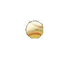
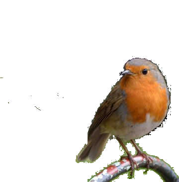
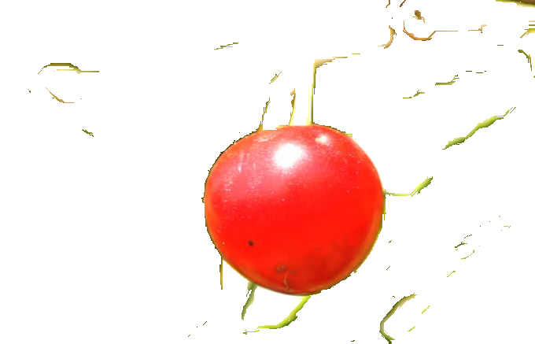
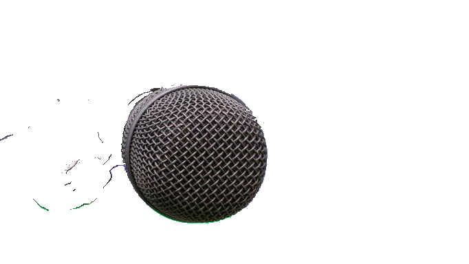

[![npm][npm-image]][npm-url]  [![javascript style guide][standard-image]][standard-url]


[npm-image]: https://img.shields.io/npm/v/npm.svg
[npm-url]: https://www.npmjs.com/package/magic-erase
[standard-image]: https://img.shields.io/badge/code_style-standard-brightgreen.svg
[standard-url]: https://standardjs.com

Clear blurry background in close-focused images, by selecting click-points on the image. Works like the magic-wand tool in Photoshop.
# Installation
`npm install magic-erase`
# Usage
```
var magicErase = require('magic-erase')
```
## Configuration
```
// Tweak the Sensitivity for optimal result

var config = {
  image: 'path-to-image', // JPG format and preferrably less than 100 kB
  sensitivity: 50, // ranges from 0.1 to 100,
  erasePoints: [
     // a list of points on the image which will be used as the click points
     // each point is <x-coordinate, y-coordinate>
     // x-coordinate is from left to right
     // y-coordinate is from top to bottom
     // coordinates are normalized within the range 0 to 100 (i.e. percentage)
    [45, 86], [87, 12], [9, 56]
  ]
}
```
## API
```
var fs = require('fs')

var firstPass = magicErase(config).then(function (response) {
  // save erased result as image file ...
  var base64Img = response.base64Img
  fs.writeFile('object.jpg', base64Img, { encoding: 'base64' }, function() {
  	console.log('Saved object image')
  })
  // use the erased result data for a second erase pass
  var data = response.data
  return data
})
```
```
var secondPass = firstPass.then(function(response) {
  var newConfig = {
    image: response,
    sensitivity: 48,
    erasePoints: [[8, 4], [65, 12]]
  }
  return magicErase(newConfig)
}).then(function(response) {
  // just like in the first pass
  var base64Img = response.base64Img
  // use base64Img ...
  return response.data
})

// .. do as many passes as you like ...

```
# Caution
- Bigger images will take longer time
# Web console
[magic-erase-console](https://github.com/rosesonfire/magic-erase-console) is a simple web console for the magic-erase package.
# Examples
Name|Image|AfterErasing|Sensitivity
-|-|-|-
Baseball|||12.2
Birb|||77.9
Cherry|||55
Mic|||14.9
Sunflower|||67.3
Flower|||0.1